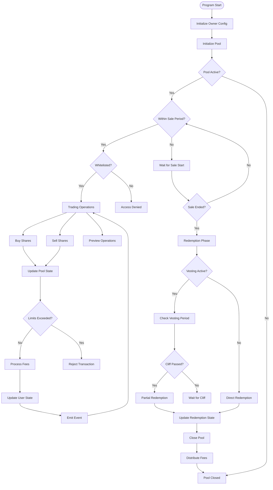
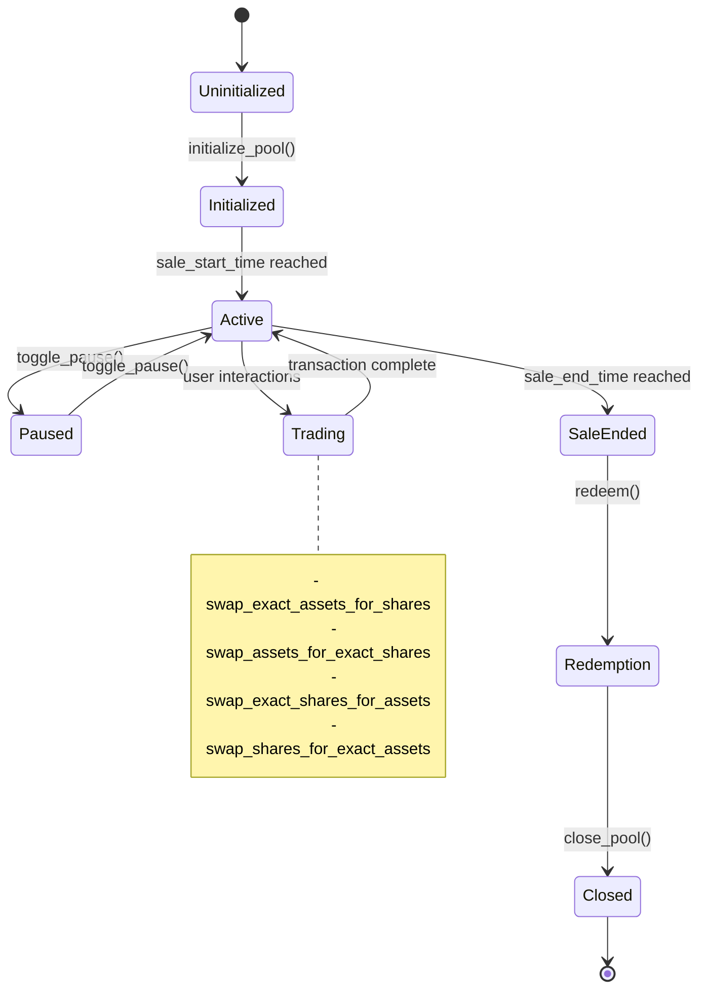
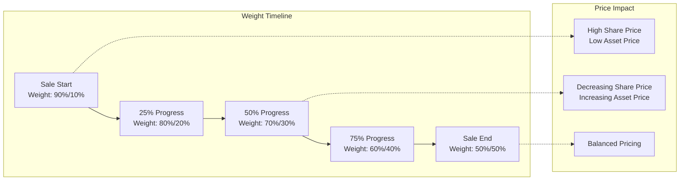
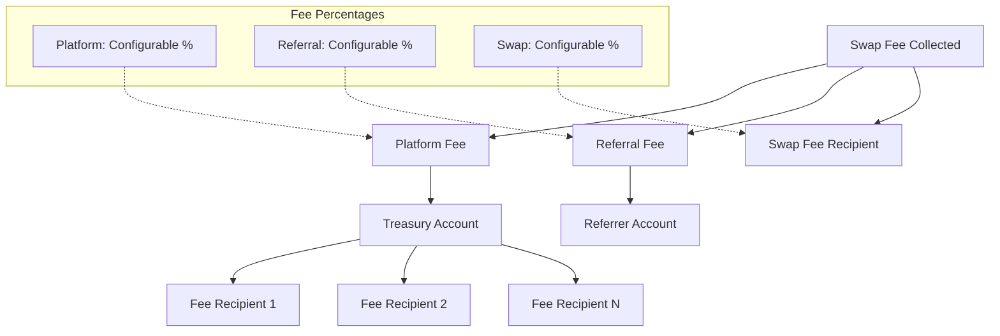
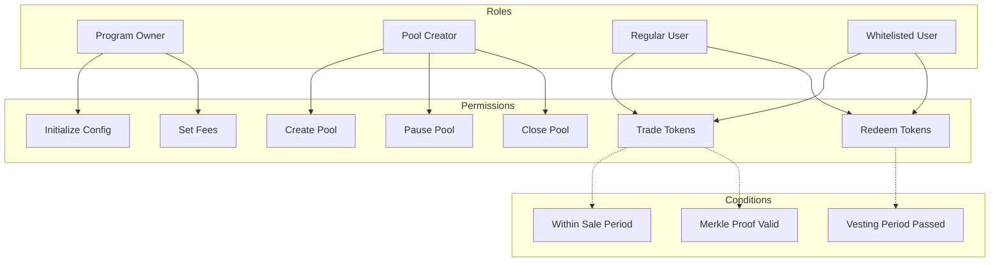
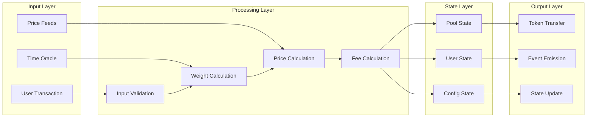
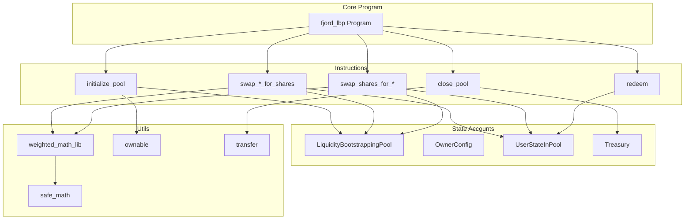

# Fjord LBP Architecture

## Program Flow Diagram

## State Transitions

## Weight Progression Over Time

## Fee Distribution Flow

## Access Control Matrix

## Data Flow Architecture

## Key Components Interaction

