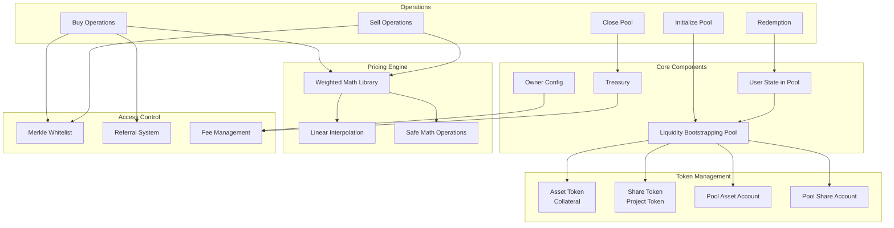

# Fjord Liquidity Bootstrapping Pool (LBP)

A Solana-based liquidity bootstrapping pool program designed for fair token distribution using weighted pricing mechanisms inspired by Balancer's approach.

## Overview

Fjord LBP is a bootstrapping pool built for the Solana Virtual Machine (SVM) that enables projects to conduct fair token launches through a weighted pricing mechanism. The system gradually adjusts token weights over time, creating a price discovery mechanism that discourages speculation and promotes fair distribution.

## Key Features

### 🎯 **Fair Price Discovery**

- Dynamic weight adjustment over time
- Weighted pricing mechanism inspired by Balancer
- Prevents front-running and speculation
- Gradual price reduction encourages fair participation

### 🔐 **Access Control**

- Whitelist support via Merkle proofs
- Optional referral system with rewards
- Vesting mechanisms for purchased tokens
- Pause functionality for emergency situations

### 💰 **Fee Management**

- Configurable platform fees
- Swap fees for transactions
- Referral rewards system
- Treasury fee distribution

### ⏰ **Time-based Controls**

- Configurable sale periods
- Vesting cliff and end times
- Automatic pool closure after sale ends

## Architecture

## Core Functionality

### Pool Initialization

- **Creator Setup**: Pool creators deposit both asset and share tokens
- **Weight Configuration**: Set starting and ending weight basis points (100-9900)
- **Time Parameters**: Configure sale start/end times and vesting periods
- **Limits**: Set maximum assets in, shares out, and share price caps

### Trading Operations

#### Buy Operations

- `swap_exact_assets_for_shares`: Trade exact assets for minimum shares
- `swap_assets_for_exact_shares`: Trade maximum assets for exact shares
- Weighted pricing based on current pool state and time progression

#### Sell Operations

- `swap_exact_shares_for_assets`: Trade exact shares for minimum assets
- `swap_shares_for_exact_assets`: Trade maximum shares for exact assets
- Only available if selling is enabled by pool creator

### Redemption System

- **Vesting Support**: Tokens can be subject to cliff and linear vesting
- **Pool Closure**: Automatic distribution of remaining tokens after sale ends
- **Fee Distribution**: Platform and referral fees distributed to recipients

## Mathematical Model

The pricing mechanism uses weighted constant product formulas:

- **Weight Interpolation**: Weights change linearly from start to end over the sale period
- **Price Calculation**: Based on reserve ratios and current weights
- **Slippage Protection**: Minimum/maximum output requirements
- **Fee Integration**: Swap fees calculated and distributed appropriately

## Security Features

- **Access Controls**: Owner-based permissions with transfer capability
- **Pause Mechanism**: Emergency pause functionality
- **Input Validation**: Comprehensive parameter validation
- **Safe Math**: Overflow/underflow protection throughout
- **Time Checks**: Prevents operations outside valid time windows

## Usage Flow

1. **Setup**: Deploy program and initialize owner configuration
2. **Pool Creation**: Creator initializes pool with tokens and parameters
3. **Trading Phase**: Users buy/sell tokens during active sale period
4. **Redemption**: Users redeem vested tokens after cliff period
5. **Closure**: Pool automatically closes and distributes remaining tokens

## Integration

The program is designed to integrate with:

- Standard SPL Token programs
- Associated Token Account program
- Solana system programs
- Frontend applications via Anchor IDL

## Development

Built with:

- **Anchor Framework**: For Solana program development
- **Rust**: Core programming language
- **SPL Tokens**: Standard token integration
- **Mathematical Libraries**: Custom weighted math implementations

---

_This program enables fair token distribution through time-weighted pricing mechanisms, promoting equitable access to new token launches on Solana._
